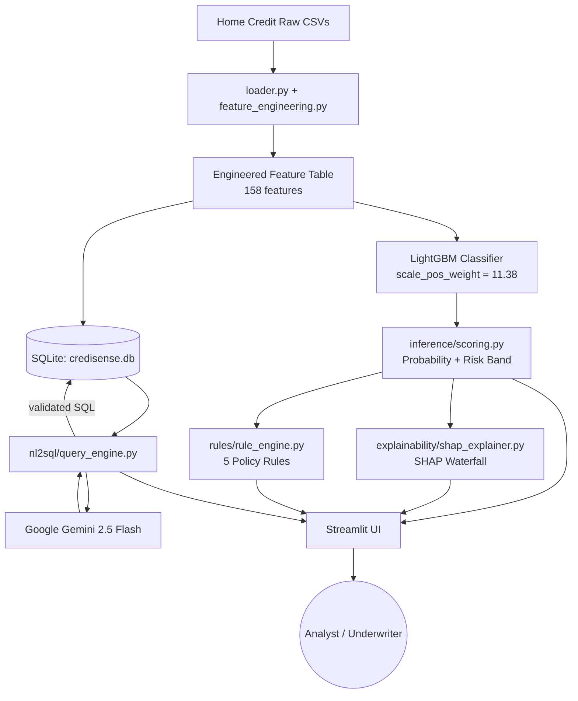

<div align="center">

# 🛡️ CrediSense AI
### AI-Powered Credit Risk Intelligence Platform

**Explainable default-risk scoring · Conversational talk-to-data · Auto-derived policy rules — in one Dockerized app**

*Built for the NeoStats AI Engineer Assignment on the [Home Credit Default Risk](https://www.kaggle.com/competitions/home-credit-default-risk/data) dataset*


</div>

---

## 📖 Table of Contents

- [What Is This?](#-what-is-this)
- [Why It Matters](#-why-it-matters-business-context)
- [Live Architecture](#-live-architecture)
- [Platform Walkthrough](#-platform-walkthrough)
- [Repository Structure](#-repository-structure)
- [Quick Start (Docker)](#-quick-start-docker--recommended)
- [Quick Start (Local, No Docker)](#-quick-start-local-no-docker)
- [Environment Variables](#-environment-variables)
- [The ML Layer](#-the-ml-layer)
- [Explainable AI (SHAP)](#-explainable-ai-shap)
- [Talk-to-Data (NL → SQL)](#-talk-to-data-nl--sql)
- [Business Rules Engine](#-business-rules-engine)
- [EDA Highlights](#-eda-highlights)
- [Prompt Engineering & Anti-Hallucination](#-prompt-engineering--anti-hallucination)
- [How This Maps to the Assignment Brief](#-how-this-maps-to-the-assignment-brief)
- [Known Limitations & Roadmap](#-known-limitations--roadmap)
- [Tech Stack](#-tech-stack)

---

## 🎯 What Is This?

**CrediSense AI** turns a raw, messy, 300K-row lending dataset into a decision-ready platform a bank could actually put in front of a credit analyst. It does five things end-to-end, in a single Streamlit app:

| # | Capability | Where |
|---|---|---|
| 1 | Explores the data and surfaces plain-English business insights | `📊 EDA & Business Insights` |
| 2 | Scores any applicant's default probability with a tuned LightGBM model | `🎯 Applicant Scoring` |
| 3 | Explains *why* the model scored someone that way, feature by feature | `💡 Explainability & SHAP` |
| 4 | Converts ML feature importances + empirical patterns into if-then credit policy rules | `⚖️ Decision Rules Engine` |
| 5 | Lets anyone ask questions about the portfolio in plain English and get grounded, SQL-backed answers | `💬 Talk-to-Data` |


---

## 🏦 Why It Matters (Business Context)

Banks need to say **yes faster** without saying yes to the wrong applicants — and they need to be able to explain every "no" to a regulator. CrediSense AI is built around that tension:

- **Speed** — a trained model scores an applicant in milliseconds instead of manual underwriting.
- **Trust** — SHAP explanations turn a black-box probability into "here are the 5 reasons this application is risky."
- **Audit-readiness** — every automated decision traces back to a named rule with an empirical rationale, not a hidden model weight.
- **Self-service analytics** — a business analyst can type *"What's the default rate by education level?"* instead of filing a ticket with data engineering.

---

## 🧭 Live Architecture



**Talk-to-Data request path**, in detail:

```
User question + last 3 conversation turns
        │
        ▼
Google Gemini (gemini-2.5-flash) generates SQL
        │
        ▼
nl2sql/validator.py — read-only allowlist, forbidden-keyword scan,
                      semicolon-injection guard, table allowlist
        │
        ▼
SQLite execution (applications / bureau_summary / previous_applications_summary)
        │
        ▼
Gemini grounded summarization (sees ONLY the question + SQL + result rows)
        │
        ▼
Streamlit chat response (with fallback to pre-validated deterministic SQL
if Gemini is unavailable or produces invalid SQL)
```

---

## 🖥️ Platform Walkthrough

<details>
<summary><b>🛡️ Executive Overview</b> — click to expand</summary>

A landing dashboard summarizing portfolio size (307,511 applicants), overall default rate (8.07%), and quick links into every module.
</details>

<details>
<summary><b>📊 EDA & Business Insights</b> — click to expand</summary>

Interactive charts across demographics, income, credit history, and repayment behaviour, plus 5 pre-computed business insights (see [EDA Highlights](#-eda-highlights)) each backed by a table of empirical default rates.
</details>

<details>
<summary><b>🎯 Applicant Scoring</b> — click to expand</summary>

Enter (or pick a sample) applicant profile → get a default probability, a risk band (**Low / Medium / High**), and a plain-language recommendation.
</details>

<details>
<summary><b>💡 Explainability & SHAP</b> — click to expand</summary>

A SHAP waterfall chart shows which features pushed this specific applicant's score up or down, translated from raw column names (e.g. `EXT_SOURCE_MEAN`) into business language ("Composite External Credit Score").
</details>

<details>
<summary><b>⚖️ Decision Rules Engine</b> — click to expand</summary>

Runs the applicant's data through 5 auditable, human-readable policy rules derived from the EDA and feature importances, and returns a final rule-based recommendation alongside (not instead of) the ML score.
</details>

<details>
<summary><b>💬 Talk-to-Data (NL-to-SQL)</b> — click to expand</summary>

A chat interface with conversation memory — ask a follow-up like *"which group has the highest rate?"* and it remembers what "it" refers to.
</details>

---

## 📁 Repository Structure

```
CrediSense-AI/
├── config/
│   └── settings.py            # Paths, model hyperparameters, risk thresholds, LLM config
├── data/
│   ├── loader.py               # CSV ingestion + memory-optimized dtype downcasting
│   ├── feature_engineering.py  # Ratio features, bureau/previous-app aggregations
│   ├── eda.py                  # Exploratory analysis + insight generation
│   └── reports/                # eda_business_insights.json, model_evaluation_metrics.json
├── models/
│   └── train.py                 # Train/test split, LightGBM training, evaluation, artifact export
├── inference/
│   └── scoring.py               # Load model, score a single applicant, assign risk band
├── explainability/
│   └── shap_explainer.py        # SHAP TreeExplainer + business-language feature translation
├── rules/
│   └── rule_engine.py           # 5 auditable decision rules + rule evaluation logic
├── nl2sql/
│   ├── prompts.py                # Versioned, token-optimized schema prompt templates
│   ├── query_engine.py           # Gemini call → validate → execute → summarize pipeline
│   └── validator.py              # SQL security & schema validation
├── sql/
│   └── db_manager.py             # Builds the SQLite database from engineered features
├── ui/
│   ├── app.py                    # Streamlit entrypoint + sidebar navigation
│   ├── styles.py                 # Custom CSS theme
│   └── views/                    # One file per platform module (EDA, scoring, SHAP, rules, chat)
├── tests/                        # Unit tests
├── Dockerfile
├── docker-compose.yml
├── requirements.txt
├── .env.example
└── README.md
```

---

## 🐳 Quick Start (Docker — Recommended)

**Prerequisites:** Docker Desktop, and the raw dataset CSVs placed in `./datasets/`

```bash
# 1. Clone the repo
git clone https://github.com/kanikapitaliya/CrediSense-AI.git
cd CrediSense-AI

# 2. Configure environment
cp .env.example .env
# then open .env and add your GEMINI_API_KEY (optional — see note below)

# 3. Build & run
docker compose up --build

# 4. Open the app
# → http://localhost:8501

# 5. Stop
docker compose down
```

The container mounts `./datasets` (read-only), `./data`, and `./models/saved_models` so cached artifacts and the SQLite index persist across restarts without expensive regeneration.

> ⚠️ Without a `GEMINI_API_KEY`, the platform doesn't crash — Talk-to-Data automatically drops into **Deterministic Fallback Mode**, answering from a library of pre-validated SQL patterns instead of fabricating a response.

---

## ⚡ Quick Start (Local, No Docker)

```bash
git clone https://github.com/kanikapitaliya/CrediSense-AI.git
cd CrediSense-AI
python -m venv venv && source venv/bin/activate   # Windows: venv\Scripts\activate
pip install -r requirements.txt

cp .env.example .env   # add GEMINI_API_KEY if you have one

# Train the model once (writes to models/saved_models/ + data/reports/)
python -m models.train

# Launch the app
streamlit run ui/app.py
```
Open `http://localhost:8501`.

---

## 🔑 Environment Variables

| Variable | Required | Default | Purpose |
|---|:---:|---|---|
| `GEMINI_API_KEY` | ⭕ Optional | *(none)* | Enables LLM-powered NL→SQL translation & summarization |
| `GEMINI_MODEL` | ⭕ Optional | `gemini-2.5-flash` | Which Gemini model to call |

---

## 🤖 The ML Layer

| Aspect | Detail |
|---|---|
| **Algorithm** | LightGBM `LGBMClassifier` (gradient-boosted trees) |
| **Why LightGBM** | Native categorical support, fast training on ~40K–300K rows, strong tabular performance, built-in feature importances for the rules engine |
| **Class imbalance strategy** | `scale_pos_weight = 11.38` (≈282,686 non-default : 24,825 default in the full training set) — reweights the minority (default) class instead of naive oversampling, avoiding synthetic-sample leakage |
| **Split** | Stratified 80/20 train/test (`random_state=42`) to preserve the ~8% default rate in both sets |
| **Feature count** | 158 engineered features (ratios, bureau aggregates, previous-application aggregates, time-based features) |
| **Evaluation** | ROC-AUC **0.751**, PR-AUC **0.241** (on a 15K-row sample run — PR-AUC is reported *alongside* ROC-AUC specifically because the ~8% positive rate makes accuracy/ROC-AUC alone misleading) |
| **Risk bands** | `< 0.07` → **Low**, `0.07–0.18` → **Medium**, `≥ 0.18` → **High** (empirically derived from the score distribution, documented in `config/settings.py` as analytical thresholds — not official policy) |
| **Top predictive signals** | `ORGANIZATION_TYPE`, `EXT_SOURCE_MEAN`, `PAYMENT_RATE`, `EXT_SOURCE_3`, `EXT_SOURCE_2`, `GOODS_TO_CREDIT_RATIO` |
| **Artifacts saved** | `lgbm_credit_model.joblib`, `model_metadata.joblib` (feature list, categorical columns, metrics, top features) |

Re-run training any time with:
```bash
python -m models.train
```

---

## 💡 Explainable AI (SHAP)

- Uses `shap.TreeExplainer` on the trained LightGBM model — exact, fast attribution for tree ensembles (no sampling approximation needed).
- Every raw feature name is mapped through a **business-language dictionary** (`explainability/shap_explainer.py`) before it reaches the UI — e.g. `EXT_SOURCE_MEAN` → *"Composite External Credit Score"*, `BUREAU_MAX_DPD` → *"Bureau Max Days Past Due"*.
- Output is a **waterfall chart** per applicant: which features pushed the risk score up (red) vs. down (green), and by how much — designed to be readable by a non-technical loan officer, not just a data scientist.

---

## 💬 Talk-to-Data (NL → SQL)

**Provider:** Google GenAI SDK, model `gemini-2.5-flash` — chosen for fast (<1s) structured-text generation and strong SQL translation accuracy at low token cost.

### 🔒 Every query is validated before execution
`nl2sql/validator.py` enforces:
1. Must start with `SELECT`, `WITH`, or `EXPLAIN`.
2. Hard-blocks `INSERT / UPDATE / DELETE / DROP / ALTER / TRUNCATE / CREATE / RENAME / REPLACE / GRANT / REVOKE / EXEC / EXECUTE`.
3. Rejects multi-statement injection (embedded `;`).
4. Only `applications`, `bureau_summary`, and `previous_applications_summary` may be referenced.

### 🗣️ 6 supported query patterns (Gemini-generated *or* deterministic fallback)

| # | Ask... | Behind the scenes |
|---|---|---|
| 1 | *"What is the default rate by education level?"* | `GROUP BY NAME_EDUCATION_TYPE` with default rate & avg income |
| 2 | *"Show average credit amount and annuity by contract type"* | `GROUP BY NAME_CONTRACT_TYPE` |
| 3 | *"What are default rates for applicants with active bureau loans?"* | `JOIN applications ↔ bureau_summary` |
| 4 | *"Compare default statistics across income types"* | `GROUP BY NAME_INCOME_TYPE HAVING count > 50` |
| 5 | *"Previous application refusal vs approval stats by education"* | `JOIN applications ↔ previous_applications_summary` |
| 6 | *"List top 10 applicants with highest requested credit amount"* | `ORDER BY AMT_CREDIT DESC LIMIT 10` |

### 🧠 Conversation memory
Session state keeps the last 3–5 turns so follow-ups like *"which group has the highest rate?"* resolve against the prior question — without re-sending the whole chat history to the LLM every time.

---

## ⚖️ Business Rules Engine

Every rule below is **derived from the EDA findings and model feature importances**, not invented — each carries an explicit rationale so an auditor can trace the "why."

| Rule | Condition | Action |
|---|---|---|
| **RULE-01** | Composite External Score `< 0.35` OR Bureau Max DPD `> 30` days | 🔴 Automated decline / high-risk escalation |
| **RULE-02** | Annuity-to-Income Ratio `> 25%` | 🟠 Mandatory DTI underwriting review |
| **RULE-03** | Age `< 28` **and** has a prior refusal | 🟡 Guarantor / collateral required |
| **RULE-04** | External Score `≥ 0.60` **and** DTI `< 15%` **and** zero bureau DPD | 🟢 Fast-track approval eligible |
| **RULE-05** | Requested credit `> 4.5×` annual income | 🟠 Credit limit scaling recommended |

Every response carries a disclaimer: these are **decision-support guidelines**, not official banking policy or a legal credit decision.

---

## 📊 EDA Highlights

Five headline findings out of the full exploratory analysis (see the `📊 EDA & Business Insights` tab for interactive charts on all of them):

1. **External score is the strongest single predictor** — applicants scoring `<0.30` default ~7× more often (23.1%) than those scoring `>0.60` (2.9%).
2. **Annuity burden matters, but non-linearly** — default rate rises from 7.3% (light burden) to 8.7% (heavy burden, 20–35% of income), then dips slightly at the extreme end.
3. **Younger applicants are riskier** — 18–30 year-olds default at 11.4% vs. 5.7% for the 50+ group.
4. **Bureau overdue history more than doubles risk** — 17.9% default rate with a history of overdue bureau payments vs. 7.5% without.
5. **Past refusals predict future risk** — applicants previously refused a loan default at 11.1% vs. 7.2% for those with only approvals.

---

## 🧪 Prompt Engineering & Anti-Hallucination

- **Token-optimized schema prompt** — a compact, versioned schema description (`nl2sql/prompts.py`) is sent instead of full table dumps; raw CSVs are never sent to the LLM.
- **Execution-first grounding** — Gemini never invents a number. It only writes SQL; the actual answer is always computed by executing that SQL against SQLite.
- **Second-pass summarization** — a separate, minimal Gemini call turns the returned DataFrame into a sentence, seeing *only* the question, the SQL, and the result — nothing else.
- **Context truncation** — conversation history capped at the last 3 turns; result previews capped at 15 rows, to control cost and prevent prompt bloat.
- **Graceful degradation** — invalid SQL, a validator rejection, or an unreachable Gemini API all fall back to a deterministic, pre-validated query library rather than failing silently or guessing.

---

## ✅ How This Maps to the Assignment Brief

| Evaluation Area (Weightage) | Where it's addressed |
|---|---|
| ML solution design & model quality (30%) | [The ML Layer](#-the-ml-layer) — LightGBM, `scale_pos_weight`, stratified split, ROC-AUC/PR-AUC |
| LLM integration & Talk-to-Data (25%) | [Talk-to-Data](#-talk-to-data-nl--sql) — Gemini + validated SQL + 6 query patterns |
| Prompt techniques & hallucination control (15%) | [Prompt Engineering & Anti-Hallucination](#-prompt-engineering--anti-hallucination) |
| EDA (15%) | [EDA Highlights](#-eda-highlights) + `📊 EDA & Business Insights` tab |
| Dockerization & engineering quality (10%) | [Quick Start (Docker)](#-quick-start-docker--recommended), modular `src`-style package layout |
| Documentation & architecture clarity (5%) | This README + the Mermaid architecture diagram |

---

## ⚠️ Known Limitations & Roadmap

**Current limitations**
- Talk-to-Data is intentionally read-only and scoped to 3 tables (`applications`, `bureau_summary`, `previous_applications_summary`) — deep multi-table joins across the full raw schema aren't exposed.
- The SQLite index is built from a 50,000-row sample of applications for local latency, not the full 307,511-row dataset.
- Risk-band thresholds (`0.07` / `0.18`) are empirically derived from the score distribution, not calibrated against a specific bank's real approval policy or profitability model.
- PR-AUC (0.241) reflects the inherent difficulty of the ~8% positive-rate problem — there's room to improve recall on true defaulters via threshold tuning or cost-sensitive optimization.

**Possible improvements**
- Swap SQLite for a production warehouse (Postgres/BigQuery) to lift the row-count ceiling.
- Add model calibration (Platt scaling / isotonic regression) so probabilities map more directly to real-world default frequencies.
- Extend the rules engine with configurable, analyst-editable thresholds instead of hardcoded constants.
- Add authentication and per-user rate limiting before any real deployment.

---

## 🧰 Tech Stack

| Layer | Choice |
|---|---|
| Language | Python 3.11 |
| ML | LightGBM, scikit-learn |
| Explainability | SHAP |
| LLM | Google Gemini (`gemini-2.5-flash`) via `google-genai` SDK |
| Data | pandas, numpy, SQLite |
| UI | Streamlit |
| Visualization | Plotly, Matplotlib, Seaborn |
| Deployment | Docker + Docker Compose |

---

<div align="center">


</div>
